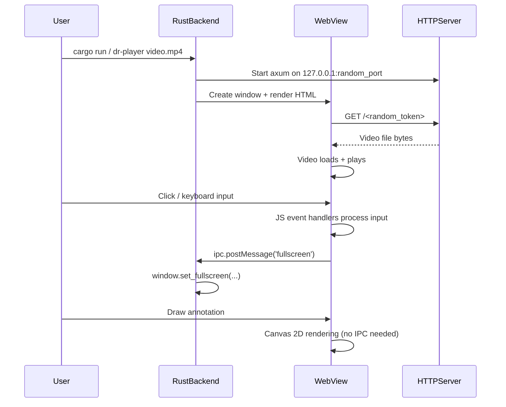

> **AI Generated Documentation**
>
> This documentation was generated by AI through static analysis of the project's source code. It represents the implementation at the time it was generated and may become outdated as the code evolves. Always treat the source code as the ultimate source of truth.

# Dr.Player

A cross-platform desktop video player with annotation drawing capabilities, built as a single Rust binary that embeds a web-based UI using system-native webviews.

---

## Purpose

Dr.Player provides a lightweight, secure video player that lets users watch local video files and draw annotations directly on the video canvas. It solves the problem of needing to visually mark up video frames for presentations, tutorials, or review without requiring external screen annotation tools.

The project is intended for:
- **Content creators** who need to annotate video during review
- **Educators** who want to highlight parts of a video during a presentation
- **Developers** who need a cross-platform embedding example using wry + tao
- **Anyone** who wants a simple, single-binary video player with drawing tools

---

## Features

- **Windows file associations** — the installer registers Dr.Player for `.mp4`, `.m4v`, `.mov` and `.webm`, so it appears in Explorer's Open with menu, in the Open with dialog, and in Settings > Default apps. Windows reserves the choice itself, so the installer takes nothing away from a program you already use
- **Video playback** with play/pause, seek, frame stepping, volume control
- **6 drawing tools**: Pen (freehand), Line, Arrow, Rectangle, Circle, Hand (select/move)
- **Undo/redo** (50-level history) via toolbar buttons or mouse buttons 3/4
- **Custom color picker** with 6 preset swatches + HTML color picker
- **Stroke size** slider, 1–20; the number keys `0`–`9` reach the even sizes in that range, 2 to 20
- **Mid-draw tool switching** — incomplete shapes are automatically cleaned up
- **Draggable drawing toolbar** — repositionable via drag handle
- **Global keyboard shortcuts**: Space, arrows, `,`/`.`, F/F11, M, L, C, H, `[`/`]`, `/`, Escape
- **Keyboard shortcuts panel** on `/` or the help button
- **Draw mode** that isolates all draw keyboard shortcuts (prevents conflicts)
- **Loop toggle** (single video repeat)
- **Fullscreen** mode (F, F11, Escape)
- **Custom window chrome** — frameless window with drag, resize (all edges), minimize, close
- **Hide the on-screen controls** with H or the eye button, with a stage drag so the window still moves
- **Fill mode** (C) — reshapes the window to the video's own shape instead of cropping the picture
- **Auto-hiding UI** — top bar and bottom HUD fade after 3s of inactivity
- **Playback speed** as a typed field, across the engine's own 0.0625 to 16 range
- **Optional update check** — one HTTPS GET per launch, opens the releases page, silent inside PDEA
- **macOS WKWebView crash mitigations**: deferred cursor mutations, custom dialogs, autoplay config
- **Error resilience**: global JS error handlers, Rust panic hook
- **Random security token** — video served via ephemeral localhost URL with 16-char random token
- **Content Security Policy** restricting media/connect sources to localhost

---

## Tech Stack

| Category | Technology |
|----------|-----------|
| Language | Rust 2021 edition, JavaScript (ES6) |
| Runtime | Rust (native desktop binary) |
| WebView | wry 0.39 (WebView2 on Windows, WKWebView on macOS, WebKitGTK on Linux) |
| Windowing | tao 0.28 |
| HTTP Server | axum 0.7 (embedded, single-route) |
| Async Runtime | tokio 1 (multi-thread, net features) |
| CLI Parsing | clap 4 (derive) |
| Serialization | serde_json 1 |
| Random | rand 0.8 |
| Icon Loading | ico 0.3 |
| Build Resources | winres 0.1 (Windows .ico embedding) |
| Installer | NSIS (installer/DrPlayer.nsi) |
| File associations | Windows registry under `HKCU\Software\Classes`, written by the installer, per user, never elevated |
| No Database | None |
| No External APIs | One optional metadata GET to the GitHub releases API |

---

## Project Structure

```
Dr.Player/
├── src/
│   └── main.rs                  # Single Rust source file: the embedded UI and all backend code
├── installer/
│   └── DrPlayer.nsi             # NSIS installer; version passed in with -DAPP_VERSION
├── docs/
│   └── WEBVIEW_QUIRKS.md        # Cross-platform webview quirk documentation
├── resources/
│   └── icon.ico                 # Application icon (Windows .ico format)
├── TESTING_videos/              # 13 test video files across 5 formats
│   ├── download_test_videos.ps1 # PowerShell script to fetch test videos
│   ├── inventory.csv            # Catalog of test videos with sources
│   └── RESEARCH_NOTES.md        # Research notes on test video sources
├── .github/
│   └── PULL_REQUEST_TEMPLATE.md # Code review checklist for PRs
├── .githooks/
│   └── pre-commit               # Pre-commit hook (tab check, cargo check)
├── .gitignore                   # Ignores target/, node_modules/, IDE, OS files
├── Cargo.toml                   # Rust project manifest, and the source of truth for the version
├── Cargo.lock                   # Rust dependency lockfile
├── build.rs                     # Windows resource compilation (embeds icon.ico)
├── RELEASE_NOTES.md             # v2.1.0, v2.0.0 and v1.0.0 release notes
├── TESTING.md                   # Manual QA testing guide
├── LICENSE                      # Copyright notice
└── README.md                    # This file
```

### Key File Explanations

**`src/main.rs`** — The entire application in a single file. Contains:
- A `const HTML: &str` embedding the complete HTML, CSS, and JavaScript UI
- All Rust backend code for CLI parsing, window management, HTTP server, the optional update check, and IPC
- `build.rs` — On Windows, compiles `resources/icon.ico` into the binary as the application icon

**`docs/WEBVIEW_QUIRKS.md`** — Documents known cross-platform issues with WKWebView (macOS), WebKitGTK (Linux), and WebView2 (Windows), along with their workarounds.

**`TESTING.md`** — Step-by-step manual QA guide covering macOS-specific tests, draw mode operations, keyboard shortcut conflicts, cross-platform matrix, crash resilience, and regression checklist.

**`RELEASE_NOTES.md`** — Documents changes in v2.1.0, v2.0.0 and v1.0.0.

**`installer/DrPlayer.nsi`** — NSIS installer for Windows. Installs into the current user's profile, so no administrator rights are needed. The version is not written in the script; it is passed in with `-DAPP_VERSION=x.y.z`, taken from `Cargo.toml`. The installer also registers the Windows file associations described under Installation, and it writes no file associations outside the user's own profile.

---

## Architecture

### Overall Design

Dr.Player is a **single-binary native desktop application** that combines:

1. **Rust backend** — window management (tao), webview rendering (wry), embedded HTTP server (axum), CLI parsing (clap)
2. **Embedded web UI** — a complete HTML/CSS/JavaScript application stored as a Rust string constant, rendered inside the system's native webview

```
┌───────────────────────────────────────────────────────┐
│                  Dr.Player Binary                      │
│                                                        │
│  ┌──────────────┐    ┌──────────────────────────┐     │
│  │   CLI Parser  │    │     tao Event Loop        │     │
│  │   (clap)      │    │  (Window Management)      │     │
│  └──────┬───────┘    └────────┬──────────────────┘     │
│         │                     │                        │
│         ▼                     ▼                        │
│  ┌──────────────────────────────────────────┐          │
│  │            wry WebView                    │          │
│  │  ┌──────────────────────────────────┐    │          │
│  │  │  Inline HTML / CSS / JavaScript  │    │          │
│  │  │  (const HTML in main.rs)         │    │          │
│  │  │                                  │    │          │
│  │  │  ┌────┐  ┌────────┐  ┌───────┐  │    │          │
│  │  │  │Video│  │Drawing │  │ HUD / │  │    │          │
│  │  │  │Player│  │Canvas  │  │ TopBar│  │    │          │
│  │  │  └────┘  └────────┘  └───────┘  │    │          │
│  │  └──────────────────────────────────┘    │          │
│  └──────────────────────────────────────────┘          │
│         ▲                                             │
│         │ IPC (window.ipc.postMessage)                 │
│         ▼                                             │
│  ┌──────────────────────────────────────────┐          │
│  │  Embedded axum HTTP Server               │          │
│  │  (127.0.0.1:random_port)                 │          │
│  │  Serves video file via /{token}          │          │
│  └──────────────────────────────────────────┘          │
└───────────────────────────────────────────────────────┘
```

### Request/Response Flow

1. **Launch**: User opens a video. On Windows that means double-clicking it, or picking Dr.Player from an Open with menu, once the installer has registered the app for its type; everywhere it means naming the file on the command line, `dr-player <video-file>`
2. **Video Serving**: Rust starts an axum HTTP server on `127.0.0.1:<random_port>` bound only to localhost. A random 16-character alphanumeric token is generated. The video file is served at `http://127.0.0.1:<port>/<token>`
3. **UI Loading**: wry creates a webview and renders the inline HTML. An initialization script sets `window.loadVideo(url)` and `window.setTitle(filename)` on `DOMContentLoaded`
4. **Video Playback**: The browser's `<video>` element loads the URL from the embedded server and plays it
5. **User Interaction**: All keyboard/mouse events are handled by JavaScript event listeners inside the webview
6. **IPC Communication**: JavaScript calls `window.ipc.postMessage(message)` to communicate with Rust for window operations (close, minimize, fullscreen, exit_fullscreen, drag_window, resize)
7. **Rust Processing**: The `with_ipc_handler` closure receives messages and manipulates the tao window



### State Management

All application state lives in JavaScript variables within the webview:

- **Video state**: `vid.paused`, `vid.currentTime`, `vid.volume`, `vid.muted`, `loopEnabled`
- **UI state**: `hideT` (auto-hide timer), `hudLock` (chrome pinned off), `hudPin` (chrome held up), `helpOpen` (shortcuts panel), `updateDismissed`
- **Window shape state**: `fillMode`, `videoAspect`, `fillOwnResize` — fill mode's own bookkeeping, so a resize it did not ask for can be told from one it did
- **Drawing state**: `tool`, `color`, `size`, `drawing`, `shapes[]`, `undoStack[]`, `redoStack[]`, `selShape`, `selShapeOffX/Y`
- **Window state**: `resizing`, `resizeDir`, `startX/Y`, `startW/H`, `dragData`

The Rust side maintains minimal state — only the event loop proxy for forwarding IPC messages.

### Drawing State Machine

The drawing system operates as a state machine:

- **States**: `idle` (drawbar closed), `ready` (drawbar open, no active draw), `drawing` (mouse button held, building shape), `dragging` (Hand tool moving a selected shape)
- **Transitions**: Tool switch mid-draw resets `drawing` to false and discards incomplete shapes (zero-length lines, single-point pen strokes)
- **Undo/Redo**: Stack-based with 50-entry depth limit. `saveDrawState()` snapshots `shapes[]` via `JSON.parse(JSON.stringify())` before each new draw action. `redoStack[]` is cleared when a new draw action occurs after undo.
- **Selection**: The Hand tool uses `hitTest()` with a 12-pixel threshold for bounding-box and point-based hit detection.

### Authentication & Security

- The video URL includes a **random 16-character alphanumeric token** (`rand::distributions::Alphanumeric`)
- The axum HTTP server **binds only to `127.0.0.1`** (localhost-only)
- A **Content Security Policy** restricts `media-src` and `connect-src` to `http://127.0.0.1:*`
- No external network access, no user authentication required

### Error Handling Strategy

**JavaScript side** (the inline script in `src/main.rs`):
- `window.addEventListener('error', ...)` — catches all unhandled JS errors, logs them as `GLOBAL_ERROR`, calls `preventDefault()` to suppress propagation
- `window.addEventListener('unhandledrejection', ...)` — catches unhandled promise rejections, logs them as `UNHANDLED_PROMISE`, calls `preventDefault()`

**Rust side**:
- `std::panic::set_hook()` — installs a custom panic hook that prints `Dr.Player internal error: {info}` to stderr instead of crashing silently

**Edge case handling**:
- `switchTool()` — if `drawing` is true, it stops the draw, checks the last shape for completeness (zero-length line/arrow/rect/circle, single-point pen), and discards it if incomplete
- `window.blur` event — resets all drag/resize/seek/draw state to prevent dangling state when window loses focus
- `mouseleave` on canvas — sets `drawing = false` and clears selection to prevent extending strokes when mouse re-enters
- Autoplay fallback — if the initial `vid.play()` promise is rejected (audio autoplay blocked), the video is muted and playback retried
- Video error handler — `vid.onerror` sets the title to 'Error loading video'
- The rate field's keydown handler — calls `e.stopPropagation()` so a keystroke aimed at the field does not fire a player shortcut instead

---

## Core Components

### Rust Backend (`src/main.rs`)

| Component | Responsibility |
|-----------|----------------|
| `Args` (clap Parser) | Parse the video file path from CLI arguments |
| `load_icon()` | Load and decode the `.ico` file for the window icon |
| `is_postable_size()` | Reject a resize whose width or height is not a finite number of at least 1 |
| `is_embedded_copy()` / `beside_an_electron_bundle()` | Decide whether this is a standalone copy or one bundled inside PDEA |
| `check_for_update()` | One HTTPS GET of the latest-release metadata, with a 5s ceiling and no retries |
| `open_in_default_browser()` | Hand a URL to the shell, so the video never leaves the window |
| `main()` | Application entry point — servers, windows, event loop |


**`main()` flow:**
1. Install Rust panic hook (`std::panic::set_hook`)
2. Parse CLI argument (video file path) via clap derive parser
3. Canonicalize the path with `std::fs::canonicalize`
4. Extract filename for window title via `PathBuf::file_name()`
5. Generate random 16-char alphanumeric token via `rand::thread_rng().sample_iter(Alphanumeric).take(16)`
6. Build axum Router with a single route `/{token}` serving the file via `tower_http::services::ServeFile`
7. Bind TCP listener to `127.0.0.1:0` (random port, localhost only)
8. Spawn axum server in background tokio task
9. Build tao event loop with user event support (`EventLoopBuilder::<String>::with_user_event()`)
10. Create frameless, resizable window (1280×720 logical size) with application icon
11. Build wry webview with:
    - Inline HTML (the entire UI as a `const HTML: &str`)
    - DevTools disabled (`with_devtools(false)`)
    - Autoplay enabled (`with_autoplay(true)`)
    - Windows: `--autoplay-policy=no-user-gesture-required` via `with_additional_browser_args`
    - Initialization script to set video URL and title on `DOMContentLoaded`
    - IPC handler forwarding messages to event loop proxy
12. Run event loop handling:
    - `CloseRequested` → `ControlFlow::Exit`
    - User events: close, minimize, fullscreen toggle, exit_fullscreen, drag_window, update_available, open_release_page, and `resize:{w}:{h}`, which takes any finite width and height of at least 1

### Embedded JavaScript Modules (the inline `<script>` in `src/main.rs`)

The inline `<script>` block contains all application logic organized into these functional modules:

#### Video Player Module
- **Elements**: `<video id="v">`, HUD buttons (play/pause, seek -5s/+5s, frame step -1F/+1F, rate field, volume, loop, fullscreen)
- **Key functions**: `showUI()`, `updateSeekbar()`, `seekFromEvent()`, `setVol()`, `volFromE()`
- **Events**: `timeupdate`, `loadedmetadata`, `play`, `pause`, `ended`, `onerror`
- **Autoplay fallback**: Attempts unmuted playback; if rejected, mutes and retries

#### Playback Rate Module
- **Field**: `#rate-input`, `role="spinbutton"`, `aria-valuemin="0.0625"`, `aria-valuemax="16"`, six characters wide so `0.0625` and `16.00` fit
- **Range**: the engine's own bounds, `RATE_MIN = 0.0625` and `RATE_MAX = 16`, not a round subset of them
- **Keys inside the field**: arrows step the rate, PageUp/PageDown step it a page, Enter commits, Escape leaves the rate in effect, Home and End are left to the caret. Every one of them stops propagating first, so typing `0.0625` does not fire a shortcut instead

#### Window Management Module
- **Drag**: `drag-handle` and `.title-capsule` mousedown → `window.ipc.postMessage('drag_window')`, plus a press on `#stage` while the chrome is hidden, so a hidden window can still be moved
- **Resize**: Edge detection within an 8px margin, direction tracking (n/s/e/w combinations), `requestAnimationFrame`-throttled IPC resize messages. No upper or lower clamp beyond the window system's own
- **Buttons**: minimize (`'minimize'`), close (`'close'`), fullscreen (`'fullscreen'`) via IPC
- **Blur handler**: Resets `resizing`, `seeking`, `vDrag`, `dragData`, `drawing`, `selShape` on window blur

#### Drawing State Machine Module
- **State variables**: `tool`, `color`, `size`, `drawing`, `shapes[]`, `undoStack[]`, `redoStack[]`, `selShape`, `selShapeOffX/Y`
- **Functions**:
  - `drawShape(ctx, s)` — renders a single shape object (pen, line, arrow, rect, circle, text)
  - `renderAll()` — clears canvas and redraws all shapes
  - `saveDrawState()` — pushes snapshot of `shapes[]` to `undoStack[]` (max 50), clears `redoStack[]`
  - `undoDraw()` — pops `undoStack[]` to `shapes[]`, pushes current to `redoStack[]`
  - `redoDraw()` — pops `redoStack[]` to `shapes[]`, pushes current to `undoStack[]`
  - `clearDrawCanvas()` — saves state, empties `shapes[]`
  - `getDrawPos(e)` — maps mouse coordinates to canvas coordinates
  - `hitTest(x, y)` — 12px threshold hit test across all shapes (bounding box for line/rect/arrow/circle, point distance for pen, measureText width for text)
  - `openDrawMode()` — activates canvas, opens drawbar, pauses video, sets cursor
  - `closeDrawMode()` — deactivates canvas, clears all shapes and stacks, closes drawbar
  - `switchTool(t)` — completes/cleans up current draw, activates new tool, updates cursor
  - `handleDrawKeydown(e)` — keyboard shortcuts isolated to draw mode context
- **Canvas events**: `mousedown`, `mousemove`, `mouseup`, `mouseleave`, `wheel`
- **Mouse button handlers**: Button 3 (back) → undo, Button 4 (forward) → redo; blocked during active drawing

#### Text Dialog Module
- Present in the source and wired to a `tool === 'text'` branch, but not reachable: there is no text tool button in the toolbar and no key that selects it
- **Elements**: `#text-dialog` (overlay), `#text-dialog-input` (text input), OK/Cancel buttons
- **Promise-based**: `showTextDialog()` returns a Promise that resolves to the entered text or `null`
- **Events**: OK/Cancel buttons, Enter key confirms, Escape key cancels, `stopPropagation()` prevents draw mode interference

#### Keyboard Shortcut Module
- **Shortcuts panel**: `/` or the help button opens it, the same key or a click outside closes it, and Tab moves through it
- **Player handler**: Listens for `keydown`; bails out early if the shortcuts panel is open or the draw bar is. Handles H (hide/show controls), C (fill mode), `[` and `]` (rate), Space, Arrow keys, Period/Comma (frame step), F/F11 (fullscreen), Escape (leave fullscreen), M (mute), L (loop toggle). Switches on `e.code`, so it is layout-independent, and tests no modifier: WebView2 holds back a fixed set of its own chords and never delivers those to the page
- **Draw handler**: Second `keydown` listener that only fires when the draw bar is open. Handles P/L/A/R/C/H (tool switch), Escape (leave draw mode), Delete (delete the picked-up shape), Backspace (clear all, still undoable), 0-9 (stroke size, the even sizes 2 to 20)
- **Shortcut isolation**: Draw mode shortcuts are completely separate from global shortcuts. When the draw bar is open, the player handler returns early before processing any key. When the draw bar is closed, the draw handler returns early.

#### UI Auto-Hide Module
- `showUI()` — shows topbar and HUD, resets the 3-second auto-hide timer
- `mousemove` and `keydown` events trigger `showUI()`; the timer re-checks that focus is not inside the chrome before it fires, so nothing invisible can be tabbed into
- `hudLock` (the eye button in the top bar) — pins the chrome off, so the auto-hide timer stops bringing it back; `hudPin` holds it up after `H` brings it back, until the mouse moves

### Embedded HTTP Server (`src/main.rs`)

- **Framework**: axum 0.7 with tower-http 0.5 (`ServeFile`)
- **Route**: `/{token}` nests `ServeFile::new(&path)`
- **Binding**: `tokio::net::TcpListener::bind("127.0.0.1:0")` — random port, localhost only
- **Lifetime**: Runs in a background tokio task spawned with `tokio::spawn`; lives as long as the application

---

## APIs

### IPC API (JavaScript → Rust)

The application uses a single IPC channel via `window.ipc.postMessage()`.

| Message | Purpose | Rust Handler |
|---------|---------|--------------|
| `'close'` | Close the application window | `*control_flow = ControlFlow::Exit` |
| `'minimize'` | Minimize the window | `window.set_minimized(true)` |
| `'fullscreen'` | Toggle fullscreen | `window.set_fullscreen(Some(Fullscreen::Borderless(None)))` if not already fullscreen, else `window.set_fullscreen(None)` |
| `'exit_fullscreen'` | Exit fullscreen | `window.set_fullscreen(None)` |
| `'drag_window'` | Start window drag | `window.drag_window()` |
| `'resize:{w}:{h}'` | Resize window to given dimensions | Parses width and height, keeps any finite pair of at least 1, calls `window.set_inner_size(LogicalSize::new(w, h))` |
| `'open_release_page'` | Open the releases page in the default browser | `ShellExecuteW` on the releases URL |

**Response format**: No return value (fire-and-forget). Messages are forwarded from `with_ipc_handler` to the tao event loop via `proxy.send_event()`.

**Error handling**: IPC handler uses `let _ = proxy.send_event(...)` to discard send failures. The resize handler silently ignores malformed messages (fewer than 3 colon-separated parts, or non-numeric values).

### HTTP API

| Method | Route | Purpose | Response |
|--------|-------|---------|----------|
| GET | `/{random_token}` | Serve the video file | Raw video file bytes with content type determined by `ServeFile` |

### Outbound HTTP

| Method | Endpoint | Purpose |
|--------|----------|---------|
| GET | `https://api.github.com/repos/Babar-Meet/Dr.Player/releases/latest` | Optional update check, one request per launch under a 5s ceiling, no retries. Skipped entirely when `DRPLAYER_EMBEDDED` is set or the executable sits beside an `app.asar`, i.e. when it is the copy bundled inside PDEA |

---

## Environment Variables

| Variable | Effect |
|----------|--------|
| `DRPLAYER_EMBEDDED` | Forces the update check off when set to anything other than `0`, `no`, `false` or `off`, and on when set to one of those. Unset or empty leaves the answer to the probe for a sibling `app.asar` |

Everything else is compile-time or CLI-based.

---

## Database

Not applicable. The application has no database, no persistent storage, and no external state.

---

## Configuration

### `Cargo.toml`
- **Package**: `dr-player`, Rust 2021 edition. The `version` field here is the single source of truth for the project version; nothing else in the repository carries a copy of it
- **Dependencies**: clap 4 (derive), tokio 1 (rt-multi-thread, macros, net), axum 0.7, tower-http 0.5 (fs), wry 0.39 (fullscreen), tao 0.28, ico 0.3, serde_json 1, rand 0.8, reqwest 0.12 (rustls-tls, default features off)
- **Build deps**: winres 0.1 (Windows only)

### `installer/DrPlayer.nsi`
- `APP_VERSION` is not defined in the script. It is passed in with `-DAPP_VERSION=x.y.z`, read from `Cargo.toml`, and the default is a visibly wrong sentinel (`0.0.0-UNSET`) so a bare `makensis` cannot produce a plausible version by accident
- One optional section registers the Windows file associations described under Installation. NSIS selects it by default because the `/o` switch is omitted from its `Section` declaration, and the user can untick it on the components page
- The shell is told about the change with `SHChangeNotify(SHCNE_ASSOCCHANGED)` on the way in and on the way out, via `${NotifyShell_AssocChanged}` from `Integration.nsh`. Without it the change can go unnoticed until after a reboot
- The finish page's Run checkbox opens Windows' own Default Apps page rather than starting the app, which cannot be started bare. It is unchecked by default (`MUI_FINISHPAGE_RUN_NOTCHECKED`), and `MUI_FINISHPAGE_RUN` is defined without a value so that `MUI_FINISHPAGE_RUN_FUNCTION` runs an `ExecShell` instead of an `Exec`, since a URI is neither an exe nor something `Exec` can resolve

### `build.rs`
- On Windows (`CARGO_CFG_TARGET_OS == "windows"`): compiles `resources/icon.ico` as the application icon via `winres::WindowsResource`

### `src/main.rs` (runtime constants)
- `RESIZE_MARGIN = 8` — pixel margin for edge detection during window resize
- `MAX_HISTORY = 50` — maximum undo/redo stack depth
- `RATE_MIN = 0.0625`, `RATE_MAX = 16` — the engine's own playback-rate bounds
- `UPDATE_TIMEOUT` — 5s ceiling on the one update-check request
- Content Security Policy embedded in HTML `<meta>` tag: restricts `default-src`, `media-src`, `connect-src` to `http://127.0.0.1:*` and `script-src` to `'unsafe-inline'`
- Window size: default 1280×720 logical pixels, no clamp on resize beyond rejecting a non-finite or sub-1-pixel pair

### `.gitignore`
- Ignores: `target/`, `dist-installer/`, `*.log`, `.vscode/`, `.idea/`, `*.swp`, `*.swo`, `node_modules/`, `.DS_Store`, `Thumbs.db`

### `.githooks/pre-commit`
- Checks for tab characters in `src/`
- Checks that no `prompt()`, `alert()`, or `confirm()` calls are added to `src/main.rs`
- Runs `cargo check`

### `.github/PULL_REQUEST_TEMPLATE.md`
- General checks: build, clippy, test, cross-platform testing, diff size
- wry/tao specific checks: evaluate_script safety, postMessage idempotency, cursor mutation rAF, prompt/alert/confirm replacement, mousedown/mouseup propagation, resize throttling
- macOS-specific checks: no synchronous evaluate_script, prompt replacement, CSS webkit prefixes
- Cross-platform checks: PathBuf usage, gitattributes, icon fallback, HiDPI
- Security checks: localhost-only binding, 16-char random token, CSP, no eval

---

## Dependencies

### Rust (Cargo)

| Dependency | Version | Purpose |
|-----------|---------|---------|
| `clap` | 4 | CLI argument parsing with derive macros (`#[derive(Parser)]`) |
| `tokio` | 1 | Async runtime for the embedded HTTP server (multi-thread, macros, net features) |
| `axum` | 0.7 | Lightweight HTTP server for serving the video file (single route) |
| `tower-http` | 0.5 | File serving utility (`ServeFile`) |
| `wry` | 0.39 | Cross-platform webview library (fullscreen feature enabled for macOS) |
| `tao` | 0.28 | Cross-platform window creation library |
| `ico` | 0.3 | ICO file parsing for window icon |
| `serde_json` | 1 | JSON serialization (escapes URLs/titles for JS) |
| `rand` | 0.8 | Random token generation for video URL |
| `reqwest` | 0.12 | HTTPS client for the optional update check. Default features off, rustls-tls on, so a Windows binary needs no OpenSSL |

### Internal Dependencies

The entire application is **self-contained in a single Rust source file**. The internal dependency chain is:
1. `main()` depends on all modules (orchestration)
2. JavaScript modules depend on each other through closure-captured variables
3. Rust → JS communication goes through initialization script (`with_initialization_script`)
4. JS → Rust communication goes through IPC (`postMessage` → `with_ipc_handler` → event loop)

---

## Installation

### Prerequisites

- **Rust toolchain** (edition 2021): https://rustup.rs
- **Platform-specific webview libraries**:
  - **Windows**: WebView2 runtime (usually pre-installed on Windows 10+)
  - **macOS**: WKWebView (built-in, no extra install)
  - **Linux**: `libwebkit2gtk-4.1-dev` (not 4.0)

### Building from Source

```bash
# Clone the repository
git clone <repository-url>
cd Dr.Player

# Build release binary
cargo build --release

# The binary is at ./target/release/dr-player (or dr-player.exe on Windows)
```

### Windows installer

```bash
# makensis does not create the OutFile directory, so make it first
mkdir dist-installer

# Pass the version in; read it from Cargo.toml rather than typing it twice.
# Quote it: PowerShell splits an unquoted -DAPP_VERSION=2.1.0 at the dots.
makensis "-DAPP_VERSION=2.1.0" installer\DrPlayer.nsi
```

The installer lands at `dist-installer\DrPlayer-Setup.exe` and bundles `target\release\dr-player.exe`, so build the binary first.

### What the installer registers on Windows

The app takes one required argument, the video to play, and exits with code 2 when started with none. Before v2.1.0 that made it unreachable by double-click, and the installer shipped a text file explaining how to start it by hand. v2.1.0 removes that file and registers real Windows file associations instead, so the normal way of opening a video reaches the app.

The components page carries one optional section, checked by default, labelled for what it does: **Dr.Player in Open with for MP4, MOV and WebM**. Untick it and the app installs with no registration at all, which is the whole of its behaviour change; nothing else on that page is optional. The four types it registers are `.mp4`, `.m4v`, `.mov` and `.webm`.

What it writes, all under `HKCU\Software\Classes`, so per user and with no administrator rights:

| Key | Values |
|------|--------|
| `Dr.Player.Video` | `FriendlyTypeName` = `Dr.Player Video`, `AllowSilentDefaultTakeOver` present with no data, `DefaultIcon` = the installed exe at icon 0, and `shell\open\command` = `"<installdir>\dr-player.exe" "%1"` |
| `.mp4`, `.m4v`, `.mov`, `.webm` | `OpenWithProgids` carrying a `Dr.Player.Video` value, which is the list that puts Dr.Player in the Open with menu and dialog |
| `.mp4`, `.m4v`, `.mov`, `.webm` | `(Default)` = `Dr.Player.Video`, plus `Content Type` and `PerceivedType` |
| `Applications\dr-player.exe` | `FriendlyAppName`, `ApplicationCompany`, `shell\open\command`, and `SupportedTypes` naming the four extensions, without which Windows would offer the exe for every extension on the machine |
| `Applications\dr-player.exe\Capabilities` | `ApplicationDescription` and `FileAssociations` mapping each extension to `Dr.Player.Video` |
| `HKCU\Software\RegisteredApplications` | a `Dr.Player` value pointing at that Capabilities key, which is what puts the app in Settings > Default apps |

The ProgID carries no version, on purpose: a later release re-registers the same name, so a user who has already chosen Dr.Player keeps a working handler instead of the shell seeing one disappear and another appear.

**Being a candidate is not being the default, and Windows never lets an installer decide that.** Windows has no supported mechanism for taking a file type away from the program a user already chose: the setting lives in `Explorer\FileExts\<ext>\UserChoice`, which is obfuscated, hash-protected and actively blocked from writes by a kernel filter driver. So the installer's job ends at offering, and three things are deliberately never written:

- anything under `Explorer\FileExts\<ext>\UserChoice`, `Hash` included
- anything under `HKLM`, both because the installer is unelevated and because per-user is the right scope
- `OpenWithList`, which Microsoft's own table marks "Do not use" in favour of `OpenWithProgids`

`AllowSilentDefaultTakeOver` is the politeness value for the same reason, and its documented behaviour is the whole point of the shape: Windows ignores the ProgID when deciding a default handler, and the ProgID keeps appearing in Open with either way.

To make Dr.Player the program that opens these types, the user does it once, in Windows' own UI, and the finish page offers to open it: tick **Open Default Apps, where I can make Dr.Player the default video player**, which opens `ms-settings:defaultapps?registeredAppUser=Dr%2EPlayer`. Windows 11 and later land on Dr.Player's own page; Windows 10 ignores the query string and opens the Default Apps page itself. The other route is right-clicking any video, **Open with > Choose another app**, picking `dr-player.exe`, and then Always. Neither one is the installer's decision to make.

Uninstalling removes exactly what was added: the ProgID key and the application key, whole and recursively, so nothing is left pointing at a deleted exe; the `Dr.Player.Video` value from each of the four `OpenWithProgids` lists, in both `Software\Classes\<ext>` and the shell's own copy under `Explorer\FileExts\<ext>`; and the `Dr.Player` values under `RegisteredApplications` and `ApplicationAssociationToasts`. Three keys are left alone on purpose: the `Software\Classes\<ext>` key and its `(Default)` value, because Microsoft's uninstall guidance says an app which took ownership of a type should leave that value in place rather than risk handing the type to the wrong owner; and `MuiCache`, `AppCompatFlags\...\Store` and `Search\JumplistData`, which are shared shell caches where the only safe operation is deleting our own value, and where the residue is cosmetic.

---

## Running

### Development

```bash
# Run with a video file (debug build)
cargo run -- <path-to-video-file>

# Or use the release binary
cargo run --release -- <path-to-video-file>
```

### Production

```bash
./target/release/dr-player <path-to-video-file>
```

### Build

```bash
cargo build --release
```

### Test

There is no automated test suite in this repository. `TESTING.md` is a manual QA checklist and `TESTING_videos/` holds sample files to run it against.

### Lint

```bash
# Rust checks
cargo check
cargo clippy

# Pre-commit hook (source root)
.githooks/pre-commit  # Checks for tabs, prompt/alert/confirm, runs cargo check
```

### Format

```bash
cargo fmt
```

---

## How It Works

### Startup Walkthrough

1. The user opens a video: on Windows by double-clicking it or choosing Dr.Player from an Open with menu, and on any platform by naming it on the command line, `dr-player video.mp4`. Both routes reach the same place, because the registered command is `"dr-player.exe" "%1"`: one process, exactly one path, which is what the single required positional argument expects
2. Rust parses the argument, resolves the file path with `std::fs::canonicalize`, and extracts the filename
3. A random 16-character alphanumeric token is generated for security
4. An axum HTTP server starts on `127.0.0.1:<random-port>`, serving the video file at `/{token}` via `tower_http::services::ServeFile`
5. A frameless tao window (1280×720 logical size) is created with the application icon loaded from `resources/icon.ico`
6. The wry webview loads the embedded HTML — a complete video player UI with:
   - Video element (`<video id="v">`), top bar (title capsule, help, hide, fill, draw, minimize, close buttons) and the optional update chip
   - Bottom chrome, one slim flat row: play/pause, the two time readouts around a full-width timeline strip, -5s, +5s, -1F, +1F, the playback rate field, volume, loop, fullscreen
   - Drawing canvas overlay with annotation toolbar (6 tools, color swatches, size slider, undo/redo/clear, seek/step, exit)
7. The initialization script calls `window.loadVideo(url)` and `window.setTitle(name)` after `DOMContentLoaded`
8. The video starts playing with autoplay enabled. If the browser blocks audio autoplay, the video is muted and playback retried
9. One background HTTPS GET asks GitHub for the latest release metadata. If the version is newer, an update chip appears in the top bar and its button opens the releases page in the default browser. A copy bundled inside PDEA skips the request entirely

### User Interaction Walkthrough

**Normal playback**: The user sees the video with a bare top bar (title capsule and window controls, with no background of its own) and an opaque bottom row. The chrome auto-hides after 3 seconds of inactivity. The user can:
- Click buttons or use keyboard shortcuts (Space, arrows, `,`/`.`, F/F11, M, L, C, H, `[`/`]`, `/`, Escape)
- Open the shortcuts panel on `/` or the help button, and close it with the same key or a click outside
- Drag the window by the title bar (drag-handle or title-capsule), or by a press on the stage when the chrome is hidden
- Resize from any edge (8px detection margin) with rAF-throttled IPC resize messages
- Press `C` to reshape the window to the video's own shape (fill mode), or press `H` to hide the chrome; the eye button in the top bar pins the chrome off

**Drawing annotations**: The user clicks ✎ in the top bar to enter draw mode. The toolbar appears, the video pauses, and the normal chrome hides. Available tools:
- **Pen (P)**: Click and drag for freehand drawing (points are accumulated as an array)
- **Line (L)**: Click and drag for straight lines
- **Arrow (A)**: Click and drag for lines with arrowheads (arrowhead size scales with stroke size, clamped 8–16px)
- **Rectangle (R)**: Click and drag diagonally
- **Circle (C)**: Click and drag from center outward (radius is Euclidean distance)
- **Hand (H)**: Click to select a shape via hitTest, drag to move it; scroll wheel changes size

The user can switch tools mid-draw — incomplete shapes (zero-length lines, single-point pen strokes) are automatically discarded. Undo (mouse button 3 or ↩ button) and redo (mouse button 4 or ↪ button) have a 50-step history. All keyboard shortcuts (P/L/A/R/C/H/0-9/Delete/Backspace/Escape) are isolated within draw mode — player shortcuts like Space, arrows, and L (loop) are blocked while the draw bar is open. The number keys `0`-`9` set the stroke size to the even sizes 2 to 20, which is what the `0`-`9` end of the 1-20 slider reaches; the slider itself reaches the odd sizes. Pressing Escape or clicking ✕ Exit returns to playback.

**Fullscreen**: Press F, F11, or click the FS button. Escape leaves fullscreen.

---

## Cross-Platform Notes

The application relies on system-native webviews via the `wry` library, which introduces platform-specific behavior:

### macOS (WKWebView)
- **Cursor mutation crash**: Setting `style.cursor` in synchronous event handlers causes `EXC_BAD_ACCESS`. Mitigated by wrapping all cursor changes in `requestAnimationFrame()` via the `setCanvasCursor()` helper.
- **`window.prompt()`/`alert()`/`confirm()` crash**: These functions are not implemented in wry's WKWebView binding. Mitigated by replacing all native dialogs with a custom HTML modal dialog (`#text-dialog`).
- **Nested DOM event dispatch**: Calling `.click()` on elements during event handlers can crash. Mitigated by calling `switchTool()` directly instead of simulating clicks.
- **Autoplay restrictions**: WKWebView blocks autoplay of audio-containing video without user gesture. Mitigated by adding `playsinline muted autoplay` to the `<video>` element and calling `.with_autoplay(true)`.
- **Fullscreen crash**: The `fullscreen` feature must be enabled in wry's Cargo features.

### Linux (WebKitGTK)
- Requires `libwebkit2gtk-4.1-dev` (not 4.0)
- CSP media-src restrictions may block localhost if not explicitly allowed

### Windows (WebView2)
- WebView2 runtime must be installed (Evergreen Bootstrapper or Fixed Version)
- `windows_subsystem = "windows"` hides the console; logs should be written to files instead

---

## Current Status

**Released** — v2.1.0. The project version lives in `Cargo.toml` and nowhere else; `RELEASE_NOTES.md` covers what this release changed.

Evidence:
- `version = "2.1.0"` in `Cargo.toml`, which is what the installer is told to stamp
- An NSIS installer that takes the version on the command line, so it cannot drift from the crate
- Windows file associations registered per user for `.mp4`, `.m4v`, `.mov` and `.webm`, from the installer's optional components section, with no write anywhere near `UserChoice`
- Manual QA guide in `TESTING.md` and sample videos in `TESTING_videos/`
- Known platform-specific issues documented in `docs/WEBVIEW_QUIRKS.md`
- Pre-commit hook enforcing code quality
- Detailed pull request template with security checklist

---

## Known Limitations

- **Single video file**: No playlist or folder support — the player accepts only one file path
- **Four registered file types on Windows**: `.mp4`, `.m4v`, `.mov` and `.webm`, deliberately. A type the embedded engine cannot decode does not fail politely: the `<video>` element fires `onerror`, the window title changes to "Error loading video", and the user is left with a frameless window to close from Task Manager. Registering a type is a claim the app has to be able to keep, which is why `.avi`, `.wmv`, `.flv`, `.mpeg` and `.ogv` are absent
- **HEVC inside MP4 is conditional**: Windows needs the HEVC Video Extension installed and a working decoder path. WebView2's Chromium build is not documented by Microsoft as carrying `proprietary_codecs`, so H.264 in MP4 is assumed and untested here; HEVC is the one place that assumption has a documented failure mode (`0xC00DB3B3`, "Failed to create HEVC decoder instance")
- **No audio device selection**: Uses system default audio output
- **No subtitle support**: SRT, VTT, or embedded subtitles not rendered
- **No keyboard shortcut customization**: All shortcuts are hardcoded
- **No video format transcoding**: Relies entirely on the webview's native `<video>` element codec support
- **Single-threaded drawing**: Canvas operations run on the UI thread; complex drawings may lag
- **No shape editing**: Once committed, shapes cannot be edited (only deleted or moved)
- **No text annotation in the shipped build**: the toolbar has no text tool and no key reaches the text branch, so text shapes cannot be created from the UI
- **No automated tests**: the previous Vitest suite was deleted; coverage is manual, via `TESTING.md`
- **macOS WKWebView-specific crashes**: Mitigated but the underlying platform quirks remain (documented in `WEBVIEW_QUIRKS.md`)
- **Linux requires `libwebkit2gtk-4.1-dev`**: Not 4.0, which may cause confusion
- **Windows requires WebView2 runtime**: Not installed by default on all Windows versions
- **No video file validation**: Invalid files show "Error loading video" without details
- **Window resize uses rAF-throttled IPC**: May feel slightly laggy on slow systems
- **Undo stack cleared on draw mode exit**: Annotations are not persisted between sessions
- **Pre-commit hook runs `cargo check`**: May be slow on large changes; runs with stderr suppressed

---

## License

Copyright (c) 2026 Babariya Meet. All rights reserved.

No permission is granted to use, copy, modify, merge, publish, distribute, sublicense, create derivative works from, reference, reverse engineer for replication, or otherwise exploit this project, in whole or in part, for any purpose without prior written permission from the copyright holder.
