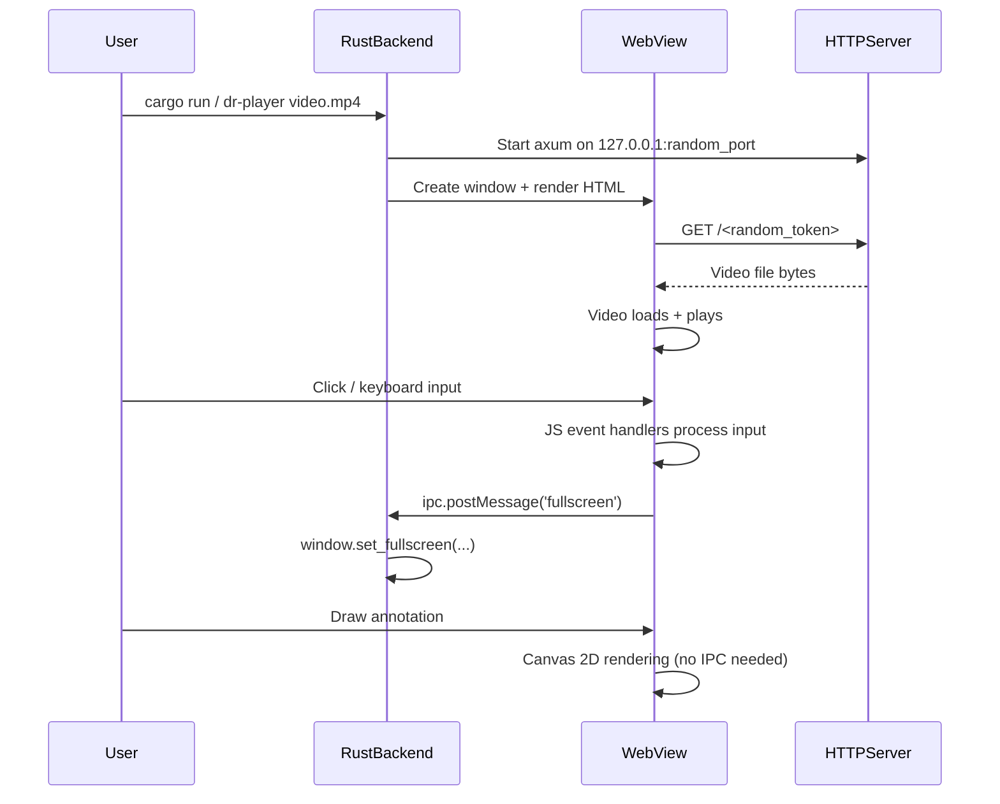

> **AI Generated Documentation**
>
> This documentation was generated by AI through static analysis of the project's source code. It represents the implementation at the time it was generated and may become outdated as the code evolves. Always treat the source code as the ultimate source of truth.

# Dr.Player

A cross-platform desktop video player with annotation drawing capabilities, built as a single Rust binary that embeds a web-based UI using system-native webviews.

---

## Purpose

Dr.Player provides a lightweight, secure video player that lets users watch local video files and draw annotations directly on the video canvas. It solves the problem of needing to visually mark up video frames for presentations, tutorials, or review without requiring external screen annotation tools.

The project is intended for:
- **Content creators** who need to annotate video during review
- **Educators** who want to highlight parts of a video during a presentation
- **Developers** who need a cross-platform embedding example using wry + tao
- **Anyone** who wants a simple, single-binary video player with drawing tools

---

## Features

- **Video playback** with play/pause, seek, frame stepping, volume control
- **7 drawing tools**: Pen (freehand), Line, Arrow, Rectangle, Circle, Text, Hand (select/move)
- **Undo/redo** (50-level history) via toolbar buttons or mouse buttons 3/4
- **Custom color picker** with 6 preset swatches + HTML color picker
- **Stroke size** control (1–20) with keyboard shortcuts (0–9)
- **Mid-draw tool switching** — incomplete shapes are automatically cleaned up
- **Draggable drawing toolbar** — repositionable via drag handle
- **Text annotation** with custom HTML dialog (replaces `window.prompt()`)
- **Global keyboard shortcuts**: Space, arrows, F/F11, M, L, period/comma
- **Draw mode** that isolates all draw keyboard shortcuts (prevents conflicts)
- **Loop toggle** (single video repeat)
- **Fullscreen** mode (F, F11, Escape)
- **Custom window chrome** — frameless window with drag, resize (all edges), minimize, close
- **Auto-hiding UI** — top bar and bottom HUD fade after 3s of inactivity (locks via ◎ button)
- **macOS WKWebView crash mitigations**: deferred cursor mutations, custom dialogs, autoplay config
- **Error resilience**: global JS error handlers, Rust panic hook
- **73 regression tests** (Vitest + jsdom)
- **Random security token** — video served via ephemeral localhost URL with 16-char random token
- **Content Security Policy** restricting media/connect sources to localhost

---

## Tech Stack

| Category | Technology |
|----------|-----------|
| Language | Rust 2021 edition, JavaScript (ES6) |
| Runtime | Rust (native desktop binary) |
| WebView | wry 0.39 (WebView2 on Windows, WKWebView on macOS, WebKitGTK on Linux) |
| Windowing | tao 0.28 |
| HTTP Server | axum 0.7 (embedded, single-route) |
| Async Runtime | tokio 1 (multi-thread, net features) |
| CLI Parsing | clap 4 (derive) |
| Serialization | serde_json 1 |
| Random | rand 0.8 |
| Icon Loading | ico 0.3 |
| Build Resources | winres 0.1 (Windows .ico embedding) |
| Testing (JS) | Vitest 4 + jsdom 29 |
| Package Manager (JS) | npm (dev dependencies only) |
| No Database | None |
| No External APIs | None |

---

## Project Structure

```
Dr.Player/
├── src/
│   └── main.rs                  # Single Rust source file (~1474 lines)
├── ui/
│   └── tests/
│       └── player.test.js       # 73 regression tests (~1249 lines)
├── docs/
│   └── WEBVIEW_QUIRKS.md        # Cross-platform webview quirk documentation
├── resources/
│   └── icon.ico                 # Application icon (Windows .ico format)
├── TESTING_videos/              # 13 test video files across 5 formats
│   ├── download_test_videos.ps1 # PowerShell script to fetch test videos
│   ├── inventory.csv            # Catalog of test videos with sources
│   └── RESEARCH_NOTES.md        # Research notes on test video sources
├── .github/
│   └── PULL_REQUEST_TEMPLATE.md # Code review checklist for PRs
├── .githooks/
│   └── pre-commit               # Pre-commit hook (tab check, cargo check)
├── .gitignore                   # Ignores target/, node_modules/, IDE, OS files
├── Cargo.toml                   # Rust project manifest
├── Cargo.lock                   # Rust dependency lockfile
├── build.rs                     # Windows resource compilation (embeds icon.ico)
├── package.json                 # JS dev dependencies (vitest, jsdom)
├── package-lock.json            # JS dependency lockfile
├── vitest.config.js             # Vitest configuration (jsdom environment)
├── RELEASE_NOTES.md             # v0.2.0 release notes
├── TESTING.md                   # Manual QA testing guide
├── LICENSE                      # Copyright notice
└── README.md                    # This file
```

### Key File Explanations

**`src/main.rs`** — The entire application in a single file. Contains:
- A `const HTML: &str` (~1337 lines) embedding the complete HTML, CSS, and JavaScript UI
- All Rust backend code (~137 lines) for CLI parsing, window management, HTTP server, and IPC
- `build.rs` — On Windows, compiles `resources/icon.ico` into the binary as the application icon

**`ui/tests/player.test.js`** — Regression tests that reconstruct the drawing state machine in jsdom, mocking the webview environment (canvas, rAF, IPC). Tests cover tool switching mid-draw, undo/redo, keyboard shortcut isolation, error resilience, and draw mode lifecycle.

**`docs/WEBVIEW_QUIRKS.md`** — Documents known cross-platform issues with WKWebView (macOS), WebKitGTK (Linux), and WebView2 (Windows), along with their workarounds.

**`TESTING.md`** — Step-by-step manual QA guide covering macOS-specific tests, draw mode operations, keyboard shortcut conflicts, cross-platform matrix, crash resilience, and regression checklist.

**`RELEASE_NOTES.md`** — Documents changes in v0.2.0, focusing on macOS crash fixes, state machine improvements, error resilience, and testing infrastructure.

---

## Architecture

### Overall Design

Dr.Player is a **single-binary native desktop application** that combines:

1. **Rust backend** — window management (tao), webview rendering (wry), embedded HTTP server (axum), CLI parsing (clap)
2. **Embedded web UI** — a complete HTML/CSS/JavaScript application stored as a Rust string constant, rendered inside the system's native webview

```
┌───────────────────────────────────────────────────────┐
│                  Dr.Player Binary                      │
│                                                        │
│  ┌──────────────┐    ┌──────────────────────────┐     │
│  │   CLI Parser  │    │     tao Event Loop        │     │
│  │   (clap)      │    │  (Window Management)      │     │
│  └──────┬───────┘    └────────┬──────────────────┘     │
│         │                     │                        │
│         ▼                     ▼                        │
│  ┌──────────────────────────────────────────┐          │
│  │            wry WebView                    │          │
│  │  ┌──────────────────────────────────┐    │          │
│  │  │  Inline HTML / CSS / JavaScript  │    │          │
│  │  │  (const HTML in main.rs)         │    │          │
│  │  │                                  │    │          │
│  │  │  ┌────┐  ┌────────┐  ┌───────┐  │    │          │
│  │  │  │Video│  │Drawing │  │ HUD / │  │    │          │
│  │  │  │Player│  │Canvas  │  │ TopBar│  │    │          │
│  │  │  └────┘  └────────┘  └───────┘  │    │          │
│  │  └──────────────────────────────────┘    │          │
│  └──────────────────────────────────────────┘          │
│         ▲                                             │
│         │ IPC (window.ipc.postMessage)                 │
│         ▼                                             │
│  ┌──────────────────────────────────────────┐          │
│  │  Embedded axum HTTP Server               │          │
│  │  (127.0.0.1:random_port)                 │          │
│  │  Serves video file via /{token}          │          │
│  └──────────────────────────────────────────┘          │
└───────────────────────────────────────────────────────┘
```

### Request/Response Flow

1. **Launch**: User runs `dr-player <video-file>` on the command line
2. **Video Serving**: Rust starts an axum HTTP server on `127.0.0.1:<random_port>` bound only to localhost. A random 16-character alphanumeric token is generated. The video file is served at `http://127.0.0.1:<port>/<token>`
3. **UI Loading**: wry creates a webview and renders the inline HTML. An initialization script sets `window.loadVideo(url)` and `window.setTitle(filename)` on `DOMContentLoaded`
4. **Video Playback**: The browser's `<video>` element loads the URL from the embedded server and plays it
5. **User Interaction**: All keyboard/mouse events are handled by JavaScript event listeners inside the webview
6. **IPC Communication**: JavaScript calls `window.ipc.postMessage(message)` to communicate with Rust for window operations (close, minimize, fullscreen, exit_fullscreen, drag_window, resize)
7. **Rust Processing**: The `with_ipc_handler` closure receives messages and manipulates the tao window



### State Management

All application state lives in JavaScript variables within the webview:

- **Video state**: `vid.paused`, `vid.currentTime`, `vid.volume`, `vid.muted`, `loopEnabled`
- **UI state**: `hideT` (auto-hide timer), `hudLock` (lock toggle), `hudVisible`
- **Drawing state**: `tool`, `color`, `size`, `drawing`, `shapes[]`, `undoStack[]`, `redoStack[]`, `selShape`, `selShapeOffX/Y`
- **Window state**: `resizing`, `resizeDir`, `startX/Y`, `startW/H`, `dragData`

The Rust side maintains minimal state — only the event loop proxy for forwarding IPC messages.

### Drawing State Machine

The drawing system operates as a state machine:

- **States**: `idle` (drawbar closed), `ready` (drawbar open, no active draw), `drawing` (mouse button held, building shape), `dragging` (Hand tool moving a selected shape)
- **Transitions**: Tool switch mid-draw resets `drawing` to false and discards incomplete shapes (zero-length lines, single-point pen strokes)
- **Undo/Redo**: Stack-based with 50-entry depth limit. `saveDrawState()` snapshots `shapes[]` via `JSON.parse(JSON.stringify())` before each new draw action. `redoStack[]` is cleared when a new draw action occurs after undo.
- **Selection**: The Hand tool uses `hitTest()` with a 12-pixel threshold for bounding-box and point-based hit detection.

### Authentication & Security

- The video URL includes a **random 16-character alphanumeric token** (`rand::distributions::Alphanumeric`)
- The axum HTTP server **binds only to `127.0.0.1`** (localhost-only)
- A **Content Security Policy** restricts `media-src` and `connect-src` to `http://127.0.0.1:*`
- No external network access, no user authentication required

### Error Handling Strategy

**JavaScript side** (`src/main.rs:604-612`):
- `window.addEventListener('error', ...)` — catches all unhandled JS errors, logs them as `GLOBAL_ERROR`, calls `preventDefault()` to suppress propagation
- `window.addEventListener('unhandledrejection', ...)` — catches unhandled promise rejections, logs them as `UNHANDLED_PROMISE`, calls `preventDefault()`

**Rust side** (`src/main.rs:1369-1371`):
- `std::panic::set_hook()` — installs a custom panic hook that prints `Dr.Player internal error: {info}` to stderr instead of crashing silently

**Edge case handling**:
- `switchTool()` — if `drawing` is true, it stops the draw, checks the last shape for completeness (zero-length line/arrow/rect/circle, single-point pen), and discards it if incomplete
- `window.blur` event — resets all drag/resize/seek/draw state to prevent dangling state when window loses focus
- `mouseleave` on canvas — sets `drawing = false` and clears selection to prevent extending strokes when mouse re-enters
- Autoplay fallback — if the initial `vid.play()` promise is rejected (audio autoplay blocked), the video is muted and playback retried
- Video error handler — `vid.onerror` sets the title to 'Error loading video'
- Text dialog keydown handler — calls `e.stopPropagation()` to prevent draw mode keyboard shortcuts from firing while the dialog is open

---

## Core Components

### Rust Backend (`src/main.rs:1339-1474`)

| Component | Lines | Responsibility |
|-----------|-------|----------------|
| `Args` (clap Parser) | 1349–1353 | Parse the video file path from CLI arguments |
| `load_icon()` | 1359–1364 | Load and decode the `.ico` file for the window icon |
| `main()` | 1367–1474 | Application entry point — servers, windows, event loop |

**`main()` flow:**
1. Install Rust panic hook (`std::panic::set_hook`)
2. Parse CLI argument (video file path) via clap derive parser
3. Canonicalize the path with `std::fs::canonicalize`
4. Extract filename for window title via `PathBuf::file_name()`
5. Generate random 16-char alphanumeric token via `rand::thread_rng().sample_iter(Alphanumeric).take(16)`
6. Build axum Router with a single route `/{token}` serving the file via `tower_http::services::ServeFile`
7. Bind TCP listener to `127.0.0.1:0` (random port, localhost only)
8. Spawn axum server in background tokio task
9. Build tao event loop with user event support (`EventLoopBuilder::<String>::with_user_event()`)
10. Create frameless, resizable window (1280×720 logical size) with application icon
11. Build wry webview with:
    - Inline HTML (the entire UI as a `const HTML: &str`)
    - DevTools disabled (`with_devtools(false)`)
    - Autoplay enabled (`with_autoplay(true)`)
    - Windows: `--autoplay-policy=no-user-gesture-required` via `with_additional_browser_args`
    - Initialization script to set video URL and title on `DOMContentLoaded`
    - IPC handler forwarding messages to event loop proxy
12. Run event loop handling:
    - `CloseRequested` → `ControlFlow::Exit`
    - User events: close, minimize, fullscreen toggle, exit_fullscreen, drag_window, resize (with width/height clamped to 200–7680 × 200–4320)

### Embedded JavaScript Modules (`src/main.rs:583-1336`)

The inline `<script>` block contains all application logic organized into these functional modules:

#### Video Player Module
- **Elements**: `<video id="v">`, HUD buttons (play/pause, seek -5s/+5s, frame step -1F/+1F, volume, loop, fullscreen)
- **Key functions**: `showUI()`, `updateSeekbar()`, `seekFromEvent()`, `setVol()`, `volFromE()`
- **Events**: `timeupdate`, `loadedmetadata`, `play`, `pause`, `ended`, `onerror`
- **Autoplay fallback** (`src/main.rs:594-602`): Attempts unmuted playback; if rejected, mutes and retries

#### Window Management Module
- **Drag**: `drag-handle` and `.title-capsule` mousedown → `window.ipc.postMessage('drag_window')`
- **Resize** (`src/main.rs:692-770`): Edge detection within 8px margin, direction tracking (n/s/e/w combinations), `requestAnimationFrame`-throttled IPC resize messages. Window dimensions clamped server-side to 200–7680 × 200–4320
- **Buttons**: minimize (`'minimize'`), close (`'close'`), fullscreen (`'fullscreen'`) via IPC
- **Blur handler** (`src/main.rs:772-780`): Resets `resizing`, `seeking`, `vDrag`, `dragData`, `drawing`, `selShape` on window blur

#### Drawing State Machine Module (`src/main.rs:928-1325`)
- **State variables**: `tool`, `color`, `size`, `drawing`, `shapes[]`, `undoStack[]`, `redoStack[]`, `selShape`, `selShapeOffX/Y`
- **Functions**:
  - `drawShape(ctx, s)` — renders a single shape object (pen, line, arrow, rect, circle, text)
  - `renderAll()` — clears canvas and redraws all shapes
  - `saveDrawState()` — pushes snapshot of `shapes[]` to `undoStack[]` (max 50), clears `redoStack[]`
  - `undoDraw()` — pops `undoStack[]` to `shapes[]`, pushes current to `redoStack[]`
  - `redoDraw()` — pops `redoStack[]` to `shapes[]`, pushes current to `undoStack[]`
  - `clearDrawCanvas()` — saves state, empties `shapes[]`
  - `getDrawPos(e)` — maps mouse coordinates to canvas coordinates
  - `hitTest(x, y)` — 12px threshold hit test across all shapes (bounding box for line/rect/arrow/circle, point distance for pen, measureText width for text)
  - `openDrawMode()` — activates canvas, opens drawbar, pauses video, sets cursor
  - `closeDrawMode()` — deactivates canvas, clears all shapes and stacks, closes drawbar
  - `switchTool(t)` — completes/cleans up current draw, activates new tool, updates cursor
  - `handleDrawKeydown(e)` — keyboard shortcuts isolated to draw mode context
- **Canvas events**: `mousedown`, `mousemove`, `mouseup`, `mouseleave`, `wheel`
- **Mouse button handlers**: Button 3 (back) → undo, Button 4 (forward) → redo; blocked during active drawing

#### Text Dialog Module (`src/main.rs:615-643`)
- Replaces `window.prompt()` with a custom HTML modal dialog
- **Elements**: `#text-dialog` (overlay), `#text-dialog-input` (text input), OK/Cancel buttons
- **Promise-based**: `showTextDialog()` returns a Promise that resolves to the entered text or `null`
- **Events**: OK/Cancel buttons, Enter key confirms, Escape key cancels, `stopPropagation()` prevents draw mode interference

#### Keyboard Shortcut Module (`src/main.rs:908-1325`)
- **Global handler** (`src/main.rs:908-925`): Listens for `keydown`; bails out early if `drawbar.classList.contains('open')`. Handles Space, Arrow keys, Period/Comma (frame step), F/F11 (fullscreen), Escape (exit fullscreen), M (mute), L (loop toggle)
- **Draw handler** (`src/main.rs:1297-1325`): Second `keydown` listener that only fires when drawbar is open. Handles P/L/A/R/C/H (tool switch), E (exit draw mode), Delete/Backspace (delete selected shape), Ctrl/Cmd+Backspace (clear all), 0-9 (stroke size)
- **Shortcut isolation**: Draw mode shortcuts are completely separate from global shortcuts. When drawbar is open, the global handler returns early before processing any key. When drawbar is closed, the draw handler returns early.

#### UI Auto-Hide Module (`src/main.rs:652-679`)
- `showUI()` — shows topbar and HUD, resets the 3-second auto-hide timer
- `mousemove` and `keydown` events trigger `showUI()`
- `hudLock` (◎ button) — toggles permanent visibility, overriding the auto-hide

### Embedded HTTP Server (`src/main.rs:1389-1396`)

- **Framework**: axum 0.7 with tower-http 0.5 (`ServeFile`)
- **Route**: `/{token}` nests `ServeFile::new(&path)`
- **Binding**: `tokio::net::TcpListener::bind("127.0.0.1:0")` — random port, localhost only
- **Lifetime**: Runs in a background tokio task spawned with `tokio::spawn`; lives as long as the application

---

## APIs

### IPC API (JavaScript → Rust)

The application uses a single IPC channel via `window.ipc.postMessage()`.

| Message | Purpose | Rust Handler |
|---------|---------|--------------|
| `'close'` | Close the application window | `*control_flow = ControlFlow::Exit` |
| `'minimize'` | Minimize the window | `window.set_minimized(true)` |
| `'fullscreen'` | Toggle fullscreen | `window.set_fullscreen(Some(Fullscreen::Borderless(None)))` if not already fullscreen, else `window.set_fullscreen(None)` |
| `'exit_fullscreen'` | Exit fullscreen | `window.set_fullscreen(None)` |
| `'drag_window'` | Start window drag | `window.drag_window()` |
| `'resize:{w}:{h}'` | Resize window to given dimensions | Parses width and height, clamps to 200–7680 × 200–4320, calls `window.set_inner_size(LogicalSize::new(w, h))` |

**Response format**: No return value (fire-and-forget). Messages are forwarded from `with_ipc_handler` to the tao event loop via `proxy.send_event()`.

**Error handling**: IPC handler uses `let _ = proxy.send_event(...)` to discard send failures. The resize handler silently ignores malformed messages (fewer than 3 colon-separated parts, or non-numeric values).

### HTTP API

| Method | Route | Purpose | Response |
|--------|-------|---------|----------|
| GET | `/{random_token}` | Serve the video file | Raw video file bytes with content type determined by `ServeFile` |

---

## Environment Variables

The application does not use any environment variables. All configuration is compile-time or CLI-based.

---

## Database

Not applicable. The application has no database, no persistent storage, and no external state.

---

## Configuration

### `Cargo.toml`
- **Package**: `dr-player` v0.1.0, Rust 2021 edition
- **Dependencies**: clap 4 (derive), tokio 1 (rt-multi-thread, macros, net), axum 0.7, tower-http 0.5 (fs), wry 0.39 (fullscreen), tao 0.28, ico 0.3, serde_json 1, rand 0.8
- **Build deps**: winres 0.1 (Windows only)

### `package.json`
- Dev dependencies: `jsdom ^29.1.1`, `vitest ^4.1.9`
- No runtime dependencies

### `vitest.config.js`
- Environment: `jsdom`
- Test pattern: `ui/tests/**/*.test.js`

### `build.rs`
- On Windows (`CARGO_CFG_TARGET_OS == "windows"`): compiles `resources/icon.ico` as the application icon via `winres::WindowsResource`

### `src/main.rs` (runtime constants)
- `RESIZE_MARGIN = 8` — pixel margin for edge detection during window resize
- `MAX_HISTORY = 50` — maximum undo/redo stack depth
- Content Security Policy embedded in HTML `<meta>` tag: restricts `default-src`, `media-src`, `connect-src` to `http://127.0.0.1:*` and `script-src` to `'unsafe-inline'`
- Window size: default 1280×720 logical pixels (clamped 200–7680 × 200–4320)

### `.gitignore`
- Ignores: `target/`, `dist-installer/`, `*.log`, `.vscode/`, `.idea/`, `*.swp`, `*.swo`, `node_modules/`, `.DS_Store`, `Thumbs.db`

### `.githooks/pre-commit`
- Checks for tab characters in `src/`
- Checks that no `prompt()`, `alert()`, or `confirm()` calls are added to `src/main.rs`
- Runs `cargo check`

### `.github/PULL_REQUEST_TEMPLATE.md`
- General checks: build, clippy, test, cross-platform testing, diff size
- wry/tao specific checks: evaluate_script safety, postMessage idempotency, cursor mutation rAF, prompt/alert/confirm replacement, mousedown/mouseup propagation, resize throttling
- macOS-specific checks: no synchronous evaluate_script, prompt replacement, CSS webkit prefixes
- Cross-platform checks: PathBuf usage, gitattributes, icon fallback, HiDPI
- Security checks: localhost-only binding, 16-char random token, CSP, no eval

---

## Dependencies

### Rust (Cargo)

| Dependency | Version | Purpose |
|-----------|---------|---------|
| `clap` | 4 | CLI argument parsing with derive macros (`#[derive(Parser)]`) |
| `tokio` | 1 | Async runtime for the embedded HTTP server (multi-thread, macros, net features) |
| `axum` | 0.7 | Lightweight HTTP server for serving the video file (single route) |
| `tower-http` | 0.5 | File serving utility (`ServeFile`) |
| `wry` | 0.39 | Cross-platform webview library (fullscreen feature enabled for macOS) |
| `tao` | 0.28 | Cross-platform window creation library |
| `ico` | 0.3 | ICO file parsing for window icon |
| `serde_json` | 1 | JSON serialization (escapes URLs/titles for JS) |
| `rand` | 0.8 | Random token generation for video URL |

### JavaScript (npm dev)

| Dependency | Version | Purpose |
|-----------|---------|---------|
| `vitest` | ^4.1.9 | Test runner for regression tests |
| `jsdom` | ^29.1.1 | DOM environment for testing without a browser |

### Internal Dependencies

The entire application is **self-contained in a single Rust source file**. The internal dependency chain is:
1. `main()` depends on all modules (orchestration)
2. JavaScript modules depend on each other through closure-captured variables
3. Rust → JS communication goes through initialization script (`with_initialization_script`)
4. JS → Rust communication goes through IPC (`postMessage` → `with_ipc_handler` → event loop)

---

## Installation

### Prerequisites

- **Rust toolchain** (edition 2021): https://rustup.rs
- **Platform-specific webview libraries**:
  - **Windows**: WebView2 runtime (usually pre-installed on Windows 10+)
  - **macOS**: WKWebView (built-in, no extra install)
  - **Linux**: `libwebkit2gtk-4.1-dev` (not 4.0)

### Building from Source

```bash
# Clone the repository
git clone <repository-url>
cd Dr.Player

# Build release binary
cargo build --release

# The binary is at ./target/release/dr-player (or dr-player.exe on Windows)
```

### Test Dependencies (optional)

```bash
npm install
```

---

## Running

### Development

```bash
# Run with a video file (debug build)
cargo run -- <path-to-video-file>

# Or use the release binary
cargo run --release -- <path-to-video-file>
```

### Production

```bash
./target/release/dr-player <path-to-video-file>
```

### Build

```bash
cargo build --release
```

### Test

```bash
# Run JavaScript regression tests
npx vitest run

# Or via npm
npm test
```

### Lint

```bash
# Rust checks
cargo check
cargo clippy

# Pre-commit hook (source root)
.githooks/pre-commit  # Checks for tabs, prompt/alert/confirm, runs cargo check
```

### Format

```bash
cargo fmt
```

---

## How It Works

### Startup Walkthrough

1. The user runs `dr-player video.mp4` from the command line
2. Rust parses the argument, resolves the file path with `std::fs::canonicalize`, and extracts the filename
3. A random 16-character alphanumeric token is generated for security
4. An axum HTTP server starts on `127.0.0.1:<random-port>`, serving the video file at `/{token}` via `tower_http::services::ServeFile`
5. A frameless tao window (1280×720 logical size) is created with the application icon loaded from `resources/icon.ico`
6. The wry webview loads the embedded HTML — a complete video player UI with:
   - Video element (`<video id="v">`), top bar (title capsule, hide button, draw button, minimize/close buttons)
   - Bottom HUD (playback controls: -5s, +5s, -1F, +1F, play/pause, seekbar, time display, volume, loop, fullscreen)
   - Drawing canvas overlay with annotation toolbar (7 tools, color swatches, size slider, undo/redo/clear, seek/step, exit)
   - Custom text input dialog (replaces `window.prompt()`)
7. The initialization script calls `window.loadVideo(url)` and `window.setTitle(name)` after `DOMContentLoaded`
8. The video starts playing with autoplay enabled. If the browser blocks audio autoplay, the video is muted and playback retried

### User Interaction Walkthrough

**Normal playback**: The user sees the video with a translucent top bar (title + window controls) and bottom HUD (play, seek, volume, loop, fullscreen). The UI auto-hides after 3 seconds of inactivity. The user can:
- Click buttons or use keyboard shortcuts (Space, arrows, Period/Comma, F/F11, M, L)
- Drag the window by the title bar (drag-handle or title-capsule)
- Resize from any edge (8px detection margin) with rAF-throttled IPC resize messages
- Lock the UI visible with the ◎ button (toggles `hudLock`)

**Drawing annotations**: The user presses D (or clicks ✎) to enter draw mode. The toolbar appears at the bottom-center, the video pauses, and the normal HUD/topbar hide. Available tools:
- **Pen (P)**: Click and drag for freehand drawing (points are accumulated as an array)
- **Line (L)**: Click and drag for straight lines
- **Arrow (A)**: Click and drag for lines with arrowheads (arrowhead size scales with stroke size, clamped 8–16px)
- **Rectangle (R)**: Click and drag diagonally
- **Circle (C)**: Click and drag from center outward (radius is Euclidean distance)
- **Text (T)**: Click to open a custom dialog, type text, confirm with OK/Enter (font size = max(12, size * 5))
- **Hand (H)**: Click to select a shape via hitTest, drag to move it; scroll wheel changes size/font

The user can switch tools mid-draw — incomplete shapes (zero-length lines, single-point pen strokes) are automatically discarded. Undo (mouse button 3 or ↩ button) and redo (mouse button 4 or ↪ button) have a 50-step history. All keyboard shortcuts (P/L/A/R/C/H/E/0-9/Delete) are isolated within draw mode — global shortcuts like Space, arrows, and L (loop) are blocked while the drawbar is open. Pressing E or clicking ✕ Exit returns to playback.

**Fullscreen**: Press F, F11, or click the FS button. Escape exits fullscreen (but does not exit draw mode; use E for that).

---

## Cross-Platform Notes

The application relies on system-native webviews via the `wry` library, which introduces platform-specific behavior:

### macOS (WKWebView)
- **Cursor mutation crash**: Setting `style.cursor` in synchronous event handlers causes `EXC_BAD_ACCESS`. Mitigated by wrapping all cursor changes in `requestAnimationFrame()` via the `setCanvasCursor()` helper.
- **`window.prompt()`/`alert()`/`confirm()` crash**: These functions are not implemented in wry's WKWebView binding. Mitigated by replacing all native dialogs with a custom HTML modal dialog (`#text-dialog`).
- **Nested DOM event dispatch**: Calling `.click()` on elements during event handlers can crash. Mitigated by calling `switchTool()` directly instead of simulating clicks.
- **Autoplay restrictions**: WKWebView blocks autoplay of audio-containing video without user gesture. Mitigated by adding `playsinline muted autoplay` to the `<video>` element and calling `.with_autoplay(true)`.
- **Fullscreen crash**: The `fullscreen` feature must be enabled in wry's Cargo features.

### Linux (WebKitGTK)
- Requires `libwebkit2gtk-4.1-dev` (not 4.0)
- CSP media-src restrictions may block localhost if not explicitly allowed

### Windows (WebView2)
- WebView2 runtime must be installed (Evergreen Bootstrapper or Fixed Version)
- `windows_subsystem = "windows"` hides the console; logs should be written to files instead

---

## Current Status

**Development** — v0.1.0 (with documented v0.2.0 release notes)

Evidence:
- Version `0.1.0` in `Cargo.toml` with detailed release notes for `v0.2.0`
- 73 regression tests with planned manual QA matrix
- Known platform-specific bugs documented in `docs/WEBVIEW_QUIRKS.md`
- Active macOS crash fixes in recent release (v0.2.0 release notes document 10+ macOS-specific fixes)
- Pre-commit hook enforcing code quality
- Detailed pull request template with security checklist

---

## Known Limitations

- **Single video file**: No playlist or folder support — the player accepts only one file path
- **No audio device selection**: Uses system default audio output
- **No subtitle support**: SRT, VTT, or embedded subtitles not rendered
- **No keyboard shortcut customization**: All shortcuts are hardcoded
- **No video format transcoding**: Relies entirely on the webview's native `<video>` element codec support
- **Single-threaded drawing**: Canvas operations run on the UI thread; complex drawings may lag
- **No shape editing**: Once committed, shapes cannot be edited (only deleted or moved)
- **Text tool has no keyboard shortcut**: Must click the toolbar button (no dedicated key)
- **Escape in draw mode does nothing**: Users must press E or click ✕ Exit (by design — prevents accidental fullscreen exit)
- **macOS WKWebView-specific crashes**: Mitigated but the underlying platform quirks remain (documented in `WEBVIEW_QUIRKS.md`)
- **Linux requires `libwebkit2gtk-4.1-dev`**: Not 4.0, which may cause confusion
- **Windows requires WebView2 runtime**: Not installed by default on all Windows versions
- **No video file validation**: Invalid files show "Error loading video" without details
- **Window resize uses rAF-throttled IPC**: May feel slightly laggy on slow systems
- **Undo stack cleared on draw mode exit**: Annotations are not persisted between sessions
- **Pre-commit hook runs `cargo check`**: May be slow on large changes; runs with stderr suppressed

---

## License

Copyright (c) 2026 Babariya Meet. All rights reserved.

No permission is granted to use, copy, modify, merge, publish, distribute, sublicense, create derivative works from, reference, reverse engineer for replication, or otherwise exploit this project, in whole or in part, for any purpose without prior written permission from the copyright holder.
