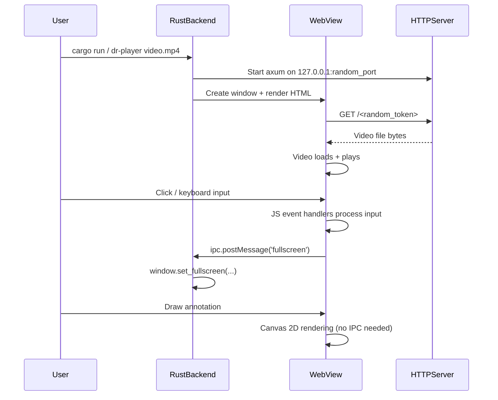

> **AI Generated Documentation**
>
> This documentation was generated by AI through static analysis of the project's source code. It represents the implementation at the time it was generated and may become outdated as the code evolves. Always treat the source code as the ultimate source of truth.

# Dr.Player

A cross-platform desktop video player with annotation drawing capabilities, built as a single Rust binary that embeds a web-based UI using system-native webviews.

---

## Purpose

Dr.Player exists to provide a lightweight, secure video player that lets users watch local video files and draw annotations directly on the video canvas. It solves the problem of needing to visually mark up video frames for presentations, tutorials, or review without requiring external screen annotation tools.

The project is intended for:
- **Content creators** who need to annotate video during review
- **Educators** who want to highlight parts of a video during a presentation
- **Developers** who need a cross-platform embedding example using wry + tao
- **Anyone** who wants a simple, single-binary video player with drawing tools

---

## Features

- **Video playback** with play/pause, seek, frame stepping, volume control
- **7 drawing tools**: Pen (freehand), Line, Arrow, Rectangle, Circle, Text, Hand (select/move)
- **Undo/redo** (50-level history) via toolbar buttons or mouse buttons 3/4
- **Custom color picker** with 6 preset swatches + HTML color picker
- **Stroke size** control (1–20) with keyboard shortcuts (0–9)
- **Mid-draw tool switching** — incomplete shapes are automatically cleaned up
- **Draggable drawing toolbar** — repositionable via drag handle
- **Text annotation** with custom HTML dialog (replaces `window.prompt()`)
- **Global keyboard shortcuts**: Space, arrows, F/F11, M, L, period/comma
- **Draw mode** that isolates all draw keyboard shortcuts (prevents conflicts)
- **Loop toggle** (single video repeat)
- **Fullscreen** mode (F, F11, Escape)
- **Custom window chrome** — frameless window with drag, resize (all edges), minimize, close
- **Auto-hiding UI** — top bar and bottom HUD fade after 3s of inactivity (locks via ◎ button)
- **macOS WKWebView crash mitigations**: deferred cursor mutations, custom dialogs, autoplay config
- **Error resilience**: global JS error handlers, Rust panic hook
- **73 regression tests** (Vitest + jsdom)
- **Random security token** — video served via ephemeral localhost URL with 16-char random token
- **Content Security Policy** restricting media/connect sources to localhost

---

## Tech Stack

| Category | Technology |
|----------|-----------|
| Language | Rust 2021 edition, JavaScript (ES6) |
| Runtime | Rust (native desktop binary) |
| WebView | wry 0.39 (WebView2 on Windows, WKWebView on macOS, WebKitGTK on Linux) |
| Windowing | tao 0.28 |
| HTTP Server | axum 0.7 (embedded, single-route) |
| Async Runtime | tokio 1 (multi-thread, net features) |
| CLI Parsing | clap 4 (derive) |
| Serialization | serde_json 1 |
| Random | rand 0.8 |
| Icon Loading | ico 0.3 |
| Build Resources | winres 0.1 (Windows .ico embedding) |
| Testing (JS) | Vitest 4 + jsdom 29 |
| Package Manager (JS) | npm (dev dependencies only) |
| No Database | None |
| No External APIs | None |

---

## Project Structure

```
Dr.Player/
├── src/
│   └── main.rs              # Single Rust source file — contains everything
├── ui/
│   └── tests/
│       └── player.test.js   # 73 regression tests for the JS drawing state machine
├── docs/
│   └── WEBVIEW_QUIRKS.md    # Cross-platform webview quirk documentation
├── resources/
│   └── icon.ico             # Application icon (Windows)
├── TESTING_videos/          # 13 test video files + download script
│   ├── download_test_videos.ps1
│   ├── inventory.csv
│   └── RESEARCH_NOTES.md    # Research notes on test video sources
├── .github/
│   └── PULL_REQUEST_TEMPLATE.md  # Code review checklist
├── .githooks/
│   └── pre-commit           # Checks tabs, prompt/alert/confirm, runs cargo check
├── Cargo.toml               # Rust project manifest
├── build.rs                 # Windows resource compilation (.ico)
├── package.json             # JS dev dependencies (vitest, jsdom)
├── vitest.config.js         # Vitest configuration
├── .gitignore               # Rust target, IDE, OS files
├── RELEASE_NOTES.md         # v0.2.0 release notes
├── TESTING.md               # Manual QA testing guide
└── README.md                # This file
```

### Key File Explanations

**`src/main.rs`** — The entire application. Contains:
- A `const HTML: &str` (~1335 lines) embedding the complete HTML, CSS, and JavaScript UI
- All Rust backend code (~140 lines) for window management, HTTP server, and IPC

**`ui/tests/player.test.js`** — Regression tests that reconstruct the drawing state machine in jsdom, mocking the webview environment (canvas, rAF, IPC). Tests cover tool switching mid-draw, undo/redo, keyboard shortcut isolation, error resilience, and draw mode lifecycle.

**`docs/WEBVIEW_QUIRKS.md`** — Documents known cross-platform issues with WKWebView (macOS), WebKitGTK (Linux), and WebView2 (Windows), along with their workarounds.

**`TESTING.md`** — Step-by-step manual QA guide covering macOS-specific tests, draw mode operations, keyboard shortcut conflicts, cross-platform matrix, crash resilience, and regression checklist.

---

## Architecture

### Overall Design

Dr.Player is a **single-binary native desktop application** that combines:

1. **Rust backend** — window management (tao), webview rendering (wry), embedded HTTP server (axum), CLI parsing (clap)
2. **Embedded web UI** — a complete HTML/CSS/JavaScript application stored as a Rust string constant, rendered inside the system's native webview

```
┌──────────────────────────────────────────────────────┐
│                  Dr.Player Binary                     │
│                                                       │
│  ┌──────────────┐    ┌──────────────────────────┐    │
│  │   CLI Parser  │    │     tao Event Loop       │    │
│  │   (clap)      │    │  (Window Management)     │    │
│  └──────┬───────┘    └────────┬─────────────────┘    │
│         │                     │                       │
│         ▼                     ▼                       │
│  ┌──────────────────────────────────────────┐        │
│  │            wry WebView                    │        │
│  │  ┌──────────────────────────────────┐    │        │
│  │  │  Inline HTML / CSS / JavaScript  │    │        │
│  │  │  (const HTML in main.rs)         │    │        │
│  │  │                                  │    │        │
│  │  │  ┌────┐  ┌────────┐  ┌───────┐  │    │        │
│  │  │  │Video│  │Drawing │  │ HUD / │  │    │        │
│  │  │  │Player│  │Canvas  │  │ TopBar│  │    │        │
│  │  │  └────┘  └────────┘  └───────┘  │    │        │
│  │  └──────────────────────────────────┘    │        │
│  └──────────────────────────────────────────┘        │
│         ▲                                            │
│         │ IPC (postMessage)                          │
│         ▼                                            │
│  ┌──────────────────────────────────────────┐        │
│  │  Embedded axum HTTP Server               │        │
│  │  (127.0.0.1:random_port)                 │        │
│  │  Serves video file via /{token}          │        │
│  └──────────────────────────────────────────┘        │
└──────────────────────────────────────────────────────┘
```

### Request/Response Flow

1. **Launch**: User runs `dr-player <video-file>` on the command line
2. **Video Serving**: Rust starts an axum HTTP server on `127.0.0.1:<random_port>` bound only to localhost. A random 16-character alphanumeric token is generated. The video file is served at `http://127.0.0.1:<port>/<token>`
3. **UI Loading**: wry creates a webview and renders the inline HTML. An initialization script sets `window.loadVideo(url)` and `window.setTitle(filename)` on `DOMContentLoaded`
4. **Video Playback**: The browser's `<video>` element loads the URL from the embedded server and plays it
5. **User Interaction**: All keyboard/mouse events are handled by JavaScript event listeners inside the webview
6. **IPC Communication**: JavaScript calls `window.ipc.postMessage(message)` to communicate with Rust for:
   - Window operations (close, minimize, fullscreen, exit_fullscreen, drag_window)
   - Window resize (resize:width:height)
7. **Rust Processing**: The `with_ipc_handler` closure receives messages and manipulates the tao window



### State Management

All application state lives in JavaScript variables within the webview:

- **Video state**: `vid.paused`, `vid.currentTime`, `vid.volume`, `vid.muted`, `loopEnabled`
- **UI state**: `hideT`, `hudLock`, `hudVisible`
- **Drawing state**: `tool`, `color`, `size`, `drawing`, `shapes[]`, `undoStack[]`, `redoStack[]`, `selShape`, `selShapeOffX/Y`
- **Window state**: `resizing`, `resizeDir`, `dragData`

The Rust side maintains minimal state — only the event loop proxy for IPC.

### Authentication & Security

- The video URL includes a **random 16-character alphanumeric token** (`rand::distributions::Alphanumeric`)
- The axum HTTP server **binds only to `127.0.0.1`** (localhost-only)
- A **Content Security Policy** restricts `media-src` and `connect-src` to `http://127.0.0.1:*`
- No external network access, no authentication required

---

## Core Components

### Rust Backend (`src/main.rs`)

| Component | Lines | Responsibility |
|-----------|-------|----------------|
| `Args` (clap Parser) | 1349–1353 | Parse the video file path from CLI arguments |
| `load_icon()` | 1359–1364 | Load and decode the `.ico` file for the window icon |
| `main()` | 1367–1474 | Application entry point — servers, windows, event loop |

**main() flow:**
1. Install Rust panic hook
2. Parse CLI argument (video file path)
3. Canonicalize the path
4. Extract filename for window title
5. Generate random 16-char token
6. Start axum server on `127.0.0.1:0` (random port)
7. Spawn server in background tokio task
8. Build tao event loop with user event support
9. Create frameless, resizable window (1280×720 logical size)
10. Load and set application icon
11. Build wry webview with:
    - Inline HTML (full UI)
    - DevTools disabled
    - Autoplay enabled
    - Windows: `--autoplay-policy=no-user-gesture-required`
    - Initialization script to set video URL and title
    - IPC handler forwarding messages to event loop
12. Run event loop handling:
    - `CloseRequested` → exit
    - User events: close, minimize, fullscreen toggle, exit_fullscreen, drag_window, resize

### Embedded JavaScript Modules

The inline `<script>` block in `const HTML` contains the following logical modules:

#### Video Player Module
- **Elements**: `<video id="v">`, HUD buttons (play, seek, volume, loop, fullscreen)
- **Key functions**: `showUI()`, `updateSeekbar()`, `seekFromEvent()`, `setVol()`, `volFromE()`
- **Events**: `timeupdate`, `loadedmetadata`, `play`, `pause`, `ended`, `onerror`

#### Window Management Module
- **Drag**: `drag-handle` and `.title-capsule` mousedown → `window.ipc.postMessage('drag_window')`
- **Resize**: Edge detection (8px margin), direction tracking (n/s/e/w), rAF-throttled IPC resize messages
- **Buttons**: minimize, close, fullscreen via IPC
- **Blur handler**: Resets all drag/resize/seek/draw state on window blur

#### Drawing State Machine Module
- **State variables**: `tool`, `color`, `size`, `drawing`, `shapes[]`, `undoStack[]`, `redoStack[]`, `selShape`
- **Functions**: `drawShape()`, `renderAll()`, `saveDrawState()`, `undoDraw()`, `redoDraw()`, `clearDrawCanvas()`, `getDrawPos()`, `hitTest()`, `openDrawMode()`, `closeDrawMode()`, `switchTool()`
- **Canvas events**: `mousedown`, `mousemove`, `mouseup`, `mouseleave`, `wheel`

#### Text Dialog Module
- Replaces `window.prompt()` with a custom HTML modal dialog
- **Promise-based**: `showTextDialog()` returns a Promise that resolves to the entered text or `null`
- **Events**: OK/Cancel buttons, Enter key confirms, Escape key cancels, `stopPropagation()` prevents draw mode interference

#### Keyboard Shortcut Module
- **Global handler**: Listens for `keydown`; bails out early if drawbar is open
- **Draw handler**: Second `keydown` listener that only fires when drawbar is open
- **Shortcut isolation**: Draw mode shortcuts (P, L, A, R, C, H, E, 0–9, Delete, Escape) are completely separate from global shortcuts (Space, arrows, F, M, L, period, comma)

### Embedded HTTP Server

- **Framework**: axum 0.7 with tower-http 0.5 (`ServeFile`)
- **Route**: `/{token}` nests `ServeFile::new(&path)`
- **Binding**: `tokio::net::TcpListener::bind("127.0.0.1:0")` — random port, localhost only
- **Lifetime**: Runs in a background tokio task; lives as long as the application

---

## APIs

### IPC API (JavaScript → Rust)

The application uses a single IPC channel via `window.ipc.postMessage()`.

| Message | Purpose | Handler |
|---------|---------|---------|
| `'close'` | Close the application window | `*control_flow = ControlFlow::Exit` |
| `'minimize'` | Minimize the window | `window.set_minimized(true)` |
| `'fullscreen'` | Toggle fullscreen | `window.set_fullscreen(...)` |
| `'exit_fullscreen'` | Exit fullscreen | `window.set_fullscreen(None)` |
| `'drag_window'` | Start window drag | `window.drag_window()` |
| `'resize:{w}:{h}'` | Resize window to given dimensions | `window.set_inner_size(...)` with clamp 200–7680 × 200–4320 |

**Response format**: No return value (fire-and-forget).

**Error handling**: IPC handler uses `let _ = proxy.send_event(...)` to discard send failures. The resize handler silently ignores malformed messages.

---

## Environment Variables

The application does not use any environment variables. All configuration is compile-time or CLI-based.

---

## Database

None. The application has no database, no persistent storage, and no external state.

---

## Configuration

### `Cargo.toml`
- **Package**: `dr-player` v0.1.0, Rust 2021 edition
- **Dependencies**: clap 4 (derive), tokio 1 (rt-multi-thread, macros, net), axum 0.7, tower-http 0.5 (fs), wry 0.39 (fullscreen), tao 0.28, ico 0.3, serde_json 1, rand 0.8
- **Build deps**: winres 0.1

### `package.json`
- Dev dependencies: `jsdom ^29.1.1`, `vitest ^4.1.9`

### `vitest.config.js`
- Environment: `jsdom`
- Test pattern: `ui/tests/**/*.test.js`

### `build.rs`
- On Windows: embeds `resources/icon.ico` as the application icon

### `src/main.rs` (constants)
- `RESIZE_MARGIN = 8` — pixel margin for edge detection during window resize
- `MAX_HISTORY = 50` — maximum undo/redo stack depth
- Content Security Policy embedded in HTML `<meta>` tag
- Window size: default 1280×720 logical pixels (clamped 200–7680 × 200–4320)

---

## Dependencies

### Rust (Cargo)

| Dependency | Version | Purpose |
|-----------|---------|---------|
| `clap` | 4 | CLI argument parsing with derive macros |
| `tokio` | 1 | Async runtime for the embedded HTTP server |
| `axum` | 0.7 | Lightweight HTTP server for serving the video file |
| `tower-http` | 0.5 | File serving utility (`ServeFile`) |
| `wry` | 0.39 | Cross-platform webview library |
| `tao` | 0.28 | Cross-platform window creation library |
| `ico` | 0.3 | ICO file parsing for window icon |
| `serde_json` | 1 | JSON serialization (escapes URLs/titles for JS) |
| `rand` | 0.8 | Random token generation for video URL |

### JavaScript (npm dev)

| Dependency | Version | Purpose |
|-----------|---------|---------|
| `vitest` | ^4.1.9 | Test runner for regression tests |
| `jsdom` | ^29.1.1 | DOM environment for testing without a browser |

### Internal Dependencies

The entire application is **self-contained in a single Rust source file**. The internal dependency chain is:
1. `main()` depends on all modules (orchestration)
2. JavaScript modules depend on each other through closure-captured variables
3. Rust JS communication goes through IPC (`postMessage` → `with_ipc_handler` → event loop)

---

## Installation

### Prerequisites

- **Rust toolchain** (edition 2021): https://rustup.rs
- **Platform-specific webview libraries**:
  - **Windows**: WebView2 runtime (usually pre-installed on Windows 10+)
  - **macOS**: WKWebView (built-in, no extra install)
  - **Linux**: `libwebkit2gtk-4.1-dev` (not 4.0)

### Building from Source

```bash
# Clone the repository
git clone <repository-url>
cd Dr.Player

# Build release binary
cargo build --release

# The binary is at ./target/release/dr-player (or dr-player.exe on Windows)
```

### Test Dependencies (optional)

```bash
npm install
```

---

## Running

### Development

```bash
# Run with a video file (debug build)
cargo run -- <path-to-video-file>

# Or use the release binary
cargo run --release -- <path-to-video-file>
```

### Production

```bash
./target/release/dr-player <path-to-video-file>
```

### Build

```bash
cargo build --release
```

### Test

```bash
# Run JavaScript regression tests
npx vitest run

# Or via npm
npm test
```

### Lint

```bash
# Rust checks
cargo check
cargo clippy

# Pre-commit hook (source root)
.githooks/pre-commit  # Checks for tabs, prompt/alert/confirm, runs cargo check
```

### Format

```bash
cargo fmt
```

---

## How It Works

### Startup Walkthrough

1. The user runs `dr-player video.mp4` from the command line
2. Rust parses the argument, resolves the file path, and extracts the filename
3. A random 16-character token is generated for security
4. An axum HTTP server starts on `127.0.0.1:<random-port>`, serving the video file at `/{token}`
5. A frameless tao window (1280×720) is created with custom window controls
6. The wry webview loads the embedded HTML — a complete video player UI with:
   - Video element, top bar (title, minimize/close buttons), bottom HUD (playback controls, seekbar, volume, loop, fullscreen)
   - Drawing canvas overlay with annotation toolbar
   - Custom text input dialog (replaces `window.prompt()`)
7. The initialization script sets `window.loadVideo(url)` and `window.setTitle(name)` after `DOMContentLoaded`
8. The video starts playing (with autoplay); if audio is blocked, it falls back to muted playback

### User Interaction Walkthrough

**Normal playback**: The user sees the video with a translucent top bar (title + window controls) and bottom HUD (play, seek, volume, loop, fullscreen). The UI auto-hides after 3 seconds of inactivity. The user can:
- Click buttons or use keyboard shortcuts
- Drag the window by the title bar
- Resize from any edge (8px detection margin)
- Lock the UI visible with the ◎ button

**Drawing annotations**: The user presses D (or clicks ✎) to enter draw mode. The toolbar appears at the bottom-center, the video pauses, and the normal HUD/topbar hide. Available tools:
- **Pen (P)**: Click and drag for freehand drawing
- **Line (L)**: Click and drag for straight lines
- **Arrow (A)**: Click and drag for lines with arrowheads
- **Rectangle (R)**: Click and drag diagonally
- **Circle (C)**: Click and drag from center outward
- **Text (T)**: Click to open a dialog, type text, confirm with OK/Enter
- **Hand (H)**: Click to select a shape, drag to move it; scroll wheel changes size/font

The user can switch tools mid-draw — incomplete shapes (zero-length lines, single-point pen strokes) are automatically discarded. Undo (mouse button 3 or ↩) and redo (mouse button 4 or ↪) have a 50-step history. All keyboard shortcuts (P/L/A/R/C/H/E/0-9/Delete) are isolated within draw mode — global shortcuts like Space, arrows, and L (loop) are blocked while the drawbar is open. Pressing E or clicking ✕ Exit returns to playback.

**Fullscreen**: Press F, F11, or click the FS button. Escape exits fullscreen (but does not exit draw mode; use E for that).

---

## Current Status

**Development** — v0.2.0

Evidence:
- Version `0.1.0` in `Cargo.toml` with detailed release notes for `v0.2.0`
- 73 regression tests with planned manual QA matrix
- Known platform-specific bugs documented in `docs/WEBVIEW_QUIRKS.md`
- Active macOS crash fixes in recent release (v0.2.0 release notes document 10+ macOS-specific fixes)
- Pre-commit hook enforcing code quality
- Detailed pull request template with security checklist

---

## Known Limitations

- **Single video file**: No playlist or folder support — the player accepts only one file path
- **No audio device selection**: Uses system default audio output
- **No subtitle support**: SRT, VTT, or embedded subtitles not rendered
- **No keyboard shortcut customization**: All shortcuts are hardcoded
- **No video format transcoding**: Relies entirely on the webview's native `<video>` element codec support
- **Single-threaded drawing**: Canvas operations run on the UI thread; complex drawings may lag
- **No shape editing**: Once committed, shapes cannot be edited (only deleted or moved)
- **Text tool has no keyboard shortcut**: Must click the toolbar button (no dedicated key)
- **Escape in draw mode does nothing**: Users must press E or click ✕ Exit (by design — prevents accidental fullscreen exit)
- **macOS WKWebView-specific crashes**: Mitigated but the underlying platform quirks remain (documented in `WEBVIEW_QUIRKS.md`)
- **Linux requires `libwebkit2gtk-4.1-dev`**: Not 4.0, which may cause confusion
- **Windows requires WebView2 runtime**: Not installed by default on all Windows versions
- **No video file validation**: Invalid files show "Error loading video" without details
- **Window resize uses rAF-throttled IPC**: May feel slightly laggy on slow systems
- **Undo stack cleared on draw mode exit**: Annotations are not persisted between sessions

### TODOs Found in Code

The codebase shows no explicit TODO comments, but the following are implicit from the implementation:

- Text tool has no dedicated keyboard shortcut (only clickable)
- Escape key behavior in draw mode could be more intuitive
- No persistence/save of annotations
- No config file for user preferences

---

## Future Improvements

- **Save/load annotations**: Serialize shapes to JSON and persist to disk alongside the video file
- **Playlist support**: Accept multiple files or directory paths
- **Subtitle rendering**: Parse SRT/VTT and overlay on video
- **Keyboard shortcut editor**: Allow remapping shortcuts via config file or UI
- **Snapshot export**: Capture annotated frames as PNG/JPEG
- **Custom tool palette**: Allow users to save custom color/size presets
- **Hardware acceleration detection**: Report if WebView's video element is using hardware decode
- **Drag-and-drop**: Drop a video file onto the window to load it
- **Zoom/pan canvas**: Support canvas zoom and pan for fine-detail annotation

---

## License

**License not specified.** The repository does not include a `LICENSE` file, `Cargo.toml` does not specify a license field, and `RELEASE_NOTES.md` makes no mention of licensing terms.
